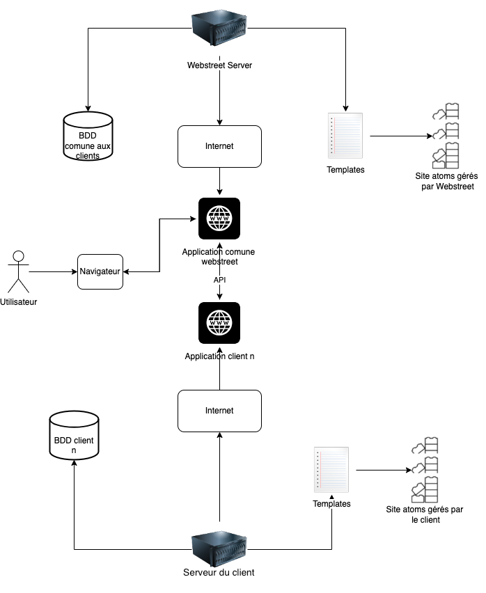
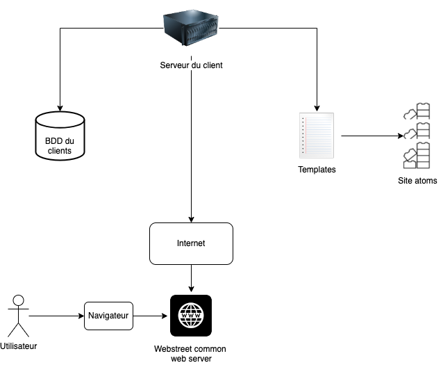

# Architecture Building Blocks

**Site Atoms:** la plus petite entité pour la mise en place d'un site web. Voir exemple [ici](../../../Images/31_Building_Block_Site_Atom.png).

**Templates:** a set of Site Atoms that work together for a specific purpose. See example [here](../../../Images/32_Building_Block_Template.png).

**Solution A:**

La solution A consiste à séparer l'application pour le client en deux sous applications:
- Une application devra stocker les informations dont le client a émis le souhait de gérer l'infrastructure
- Une autre application devra stocker le reste des informations et s'occuper de la communication avec le navigateur des utilisateurs

L'application gérée par webstreet sera hébergée dans des serveurs à haute disponibilité et pouvant gérer de forts pics de connexion. De cette manière le client n'aurra pas à s'occuper de scale la majeure partie de l'infrasctructure et pourra avoir accès à des serveurs moins chers grâce à la mise en comun de nos ressources.

Afin de pouvoir faire coexister ces de ux applications, un système d'API devra être mis en place. Chaque site atoms présent sur l'application hébergé par le client devra pouvoir permettre de réaliseres actions de CRUD sauf cas spécifique de sécurité.

Dans le cas où le client souhaite conserver les informations d'authentification de ses utilisateurs,, l'API devra permettre de vérifier à partir des données rentrées dans l'IHM vérifier que les identifiants sont corrects.

Tableau récapitulatif des réponse de la solution A aux nouvelles exigences:

| Exigence                                                                                                                                                  | Solution apportée                                                                                                                                              | Points forts de la solution | Lacunes de la solution |
|-----------------------------------------------------------------------------------------------------------------------------------------------------------|----------------------------------------------------------------------------------------------------------------------------------------------------------------|-----------------------------|------------------------|
| L'acheteur doit récupérer le site sur un module spécifique                                                                                                | Une image Docker sera stockée sur un registry privé afin de protéger le code du site                                                                        |                             |                        |
| Notre hébergeur doit traiter le contenu volumineux                                                                                                        | Nous mettrons en place des serveurs de fichiers et des serveurs de DB afin de prendre en charge les contenus volumineux                                  |                             |                        |
| Le client doit pouvoir choisir d'héberger des données qu'il juge  sensibles sur sa propre infrastructure                                               | Mise en place d'une option sur les site atoms les plus sensibles qui permettrait de choisir de garder chez soi les données relatives à ce site atom      |                             |                        |
| Le client doit avoir à sa disposition l'application lui permettant de stocker les données qu'il a jugé trop sensible                                   |                                                                                                                                                                |                             |                        |
| Différenciation des serveurs d'infrastructure et d'administration sur nos hébergeurs et des serveurs contenant des données sensibles chez le client | Mise en place de serveurs cloud hébergeant le site de plusieurs clients en même temps qui communiquent par API avec les serveurs du client               |                             |                        |
| Toute mise à jour devra être effectuée sur nos serveurs sur demande de l'acheteur                                                                      | Nous mettrons en place des outils de devops sur nos outils de communication qui permettront aux clients de créer  automatiquement de nouvelles pipelines |                             |                        |
| Les mises à jour seront centralisées et envoyées à tous nos clients  en même temps.                                                                    |                                                                                                                                                                |                             |                        |

**Solution B:**

| Exigence                                                                                                                                                  | Solution apportée                                                                                                                                              | Points forts de la solution | Lacunes de la solution |
|-----------------------------------------------------------------------------------------------------------------------------------------------------------|----------------------------------------------------------------------------------------------------------------------------------------------------------------|-----------------------------|------------------------|
| L'acheteur doit récupérer le site sur un module spécifique                                                                                                | Une image Docker sera stockée sur un registry privé afin de protéger le code du site                                                                        |                             |                        |
| Notre hébergeur doit traiter le contenu volumineux                                                                                                        | Nous mettrons en place des serveurs de fichiers et des serveurs de DB afin de prendre en charge les contenus volumineux                                  |                             |                        |
| Le client doit pouvoir choisir d'héberger des données qu'il juge  sensibles sur sa propre infrastructure                                               | Mise en place d'une option sur les site atoms les plus sensibles qui permettrait de choisir de garder chez soi les données relatives à ce site atom      |                             |                        |
| Le client doit avoir à sa disposition l'application lui permettant de stocker les données qu'il a jugé trop sensible                                   |                                                                                                                                                                |                             |                        |
| Différenciation des serveurs d'infrastructure et d'administration sur nos hébergeurs et des serveurs contenant des données sensibles chez le client | Mise en place de serveurs cloud hébergeant le site de plusieurs clients en même temps qui communiquent par API avec les serveurs du client               |                             |                        |
| Toute mise à jour devra être effectuée sur nos serveurs sur demande de l'acheteur                                                                      | Nous mettrons en place des outils de devops sur nos outils de communication qui permettront aux clients de créer  automatiquement de nouvelles pipelines |                             |                        |
| Les mises à jour seront centralisées et envoyées à tous nos clients  en même temps.                                                                    |                                                                                                                                                                |                             |                        |

