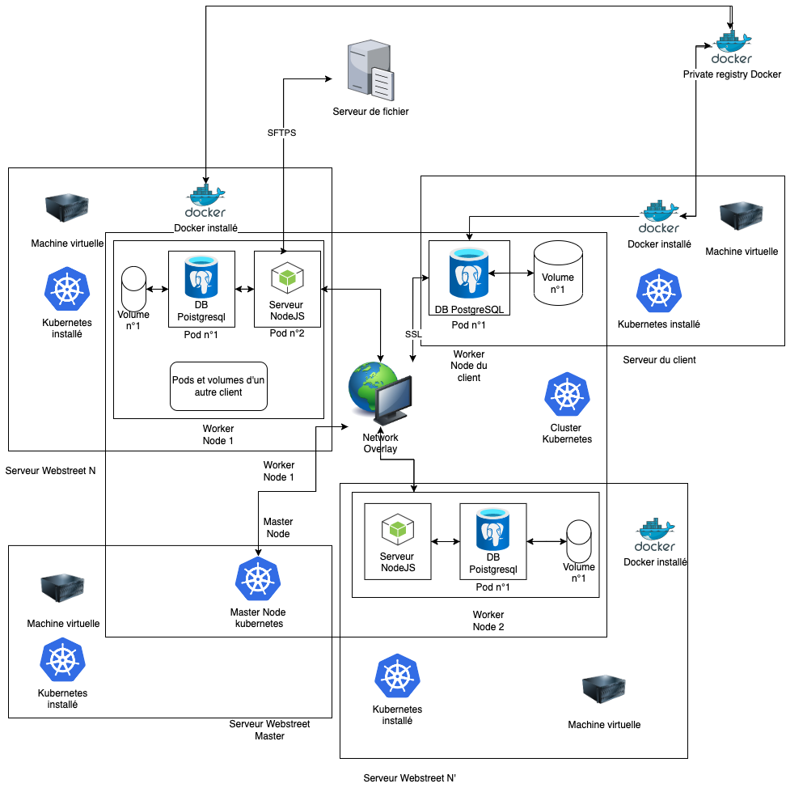
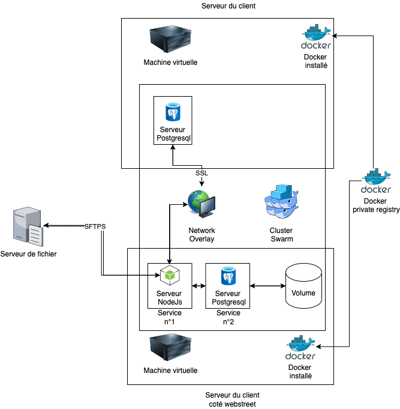

# Architecture Building Blocks

**Site Atoms:** la plus petite entité pour la mise en place d'un site web. Voir exemple [ici](../../../Images/31_Building_Block_Site_Atom.png).

**Templates:** a set of Site Atoms that work together for a specific purpose. See example [here](../../../Images/32_Building_Block_Template.png).

**Solution privilégiant l'apect technique:**

Cette solution visant à fournir une répone technique à la probèmatique consiste à mettre en comun des ressources d'infrastructure réseau entre les différents sites des clients par le moyen d'un cluster Kubernetes:
Nous mettrons à disposition des serveurs de très grande capacité qui seront partagées entre les clients. Chaque client se vera attribuer un minimum de 2 nodes qui seront dans des serveurs situés dans des availaibility zones différentes
Cette solution présente de nombreux avantages:
- Une fois la solution mise en place, la mise en place d'une nouvelle application d'un client est très rapide, il suffit de faire entrer le serveur du client dans le cluster kubernetes et de créer les pods coté Webstreet en ligne de commande
- L'utilisation de grands serveurs coté webstreet permet de grandement faciliter le scale des applications, une applicatiopn peut absorber un pic de connexion plus élevé si les autres ont peu de connexion
- Kubernetes est un système d'orchestration des nodes qui sait gérer les ressources de façon inteligente et  optimisée

Les images de l'application seront stockées de façon sécurisée sur un registry Docker privé créé pour l'ocasion.

| Exigence                                                                                                                                                  | Solution apportée                                                                                                                                              | Points forts de la solution | Lacunes de la solution |
|-----------------------------------------------------------------------------------------------------------------------------------------------------------|----------------------------------------------------------------------------------------------------------------------------------------------------------------|-----------------------------|------------------------|
| L'acheteur doit récupérer le site sur un module spécifique                                                                                                | Une image Docker sera stockée sur un registry privé afin de protéger le code du site                                                                        |                             |                        |
| Notre hébergeur doit traiter le contenu volumineux                                                                                                        | Nous mettrons en place des serveurs de fichiers et des serveurs de DB afin de prendre en charge les contenus volumineux                                  |                             |                        |
| Le client doit pouvoir choisir d'héberger des données qu'il juge  sensibles sur sa propre infrastructure                                               | Mise en place d'une option sur les site atoms les plus sensibles qui permettrait de choisir de garder chez soi les données relatives à ce site atom      |                             |                        |
| Le client doit avoir à sa disposition l'application lui permettant de stocker les données qu'il a jugé trop sensible                                   |                                                                                                                                                                |                             |                        |
| Différenciation des serveurs d'infrastructure et d'administration sur nos hébergeurs et des serveurs contenant des données sensibles chez le client | Mise en place de serveurs cloud hébergeant le site de plusieurs clients en même temps qui communiquent par API avec les serveurs du client               |                             |                        |
| Toute mise à jour devra être effectuée sur nos serveurs sur demande de l'acheteur                                                                      | Nous mettrons en place des outils de devops sur nos outils de communication qui permettront aux clients de créer  automatiquement de nouvelles pipelines |                             |                        |
| Les mises à jour seront centralisées et envoyées à tous nos clients  en même temps.                                                                    |                                                                                                                                                                |                             |                        |

**Solution privilégiant l'aspect commercial:**

| Exigence                                                                                                                                                  | Solution apportée                                                                                                                                              | Points forts de la solution | Lacunes de la solution |
|-----------------------------------------------------------------------------------------------------------------------------------------------------------|----------------------------------------------------------------------------------------------------------------------------------------------------------------|-----------------------------|------------------------|
| L'acheteur doit récupérer le site sur un module spécifique                                                                                                | Une image Docker sera stockée sur un registry privé afin de protéger le code du site                                                                        |                             |                        |
| Notre hébergeur doit traiter le contenu volumineux                                                                                                        | Nous mettrons en place des serveurs de fichiers et des serveurs de DB afin de prendre en charge les contenus volumineux                                  |                             |                        |
| Le client doit pouvoir choisir d'héberger des données qu'il juge  sensibles sur sa propre infrastructure                                               | Mise en place d'une option sur les site atoms les plus sensibles qui permettrait de choisir de garder chez soi les données relatives à ce site atom      |                             |                        |
| Le client doit avoir à sa disposition l'application lui permettant de stocker les données qu'il a jugé trop sensible                                   |                                                                                                                                                                |                             |                        |
| Différenciation des serveurs d'infrastructure et d'administration sur nos hébergeurs et des serveurs contenant des données sensibles chez le client | Mise en place de serveurs cloud hébergeant le site de plusieurs clients en même temps qui communiquent par API avec les serveurs du client               |                             |                        |
| Toute mise à jour devra être effectuée sur nos serveurs sur demande de l'acheteur                                                                      | Nous mettrons en place des outils de devops sur nos outils de communication qui permettront aux clients de créer  automatiquement de nouvelles pipelines |                             |                        |
| Les mises à jour seront centralisées et envoyées à tous nos clients  en même temps.                                                                    |                                                                                                                                                                |                             |                        |
